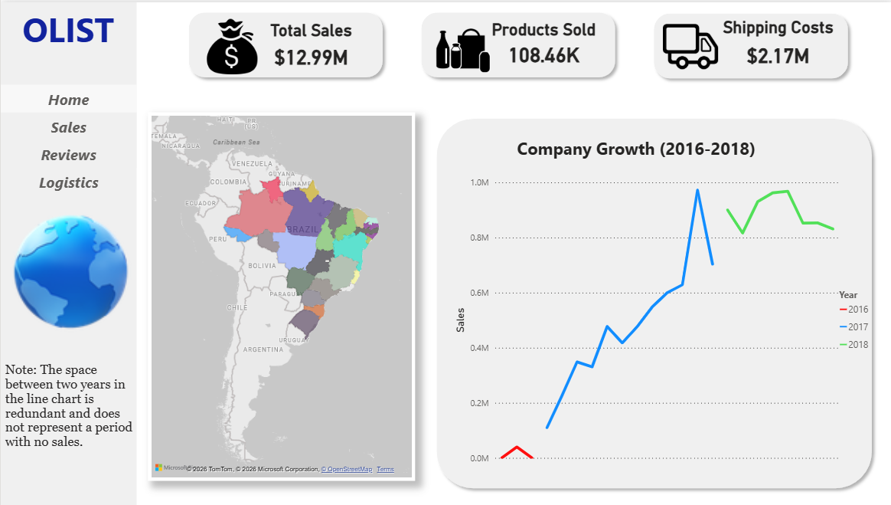
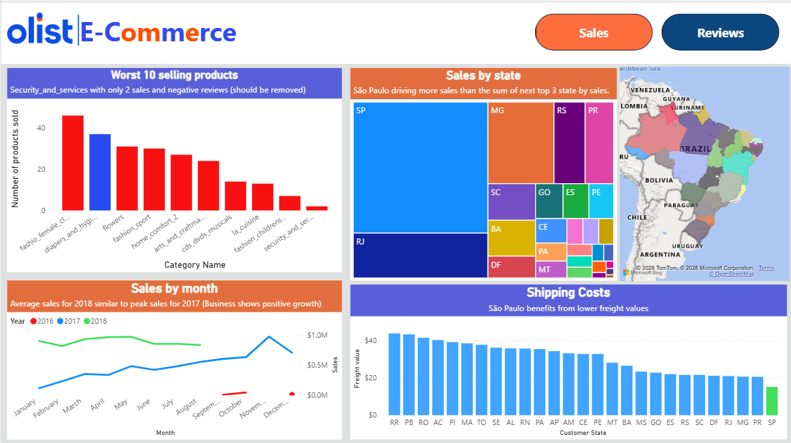
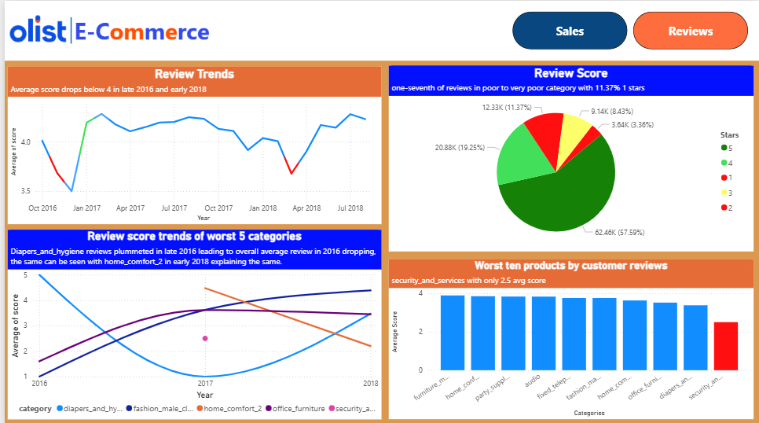
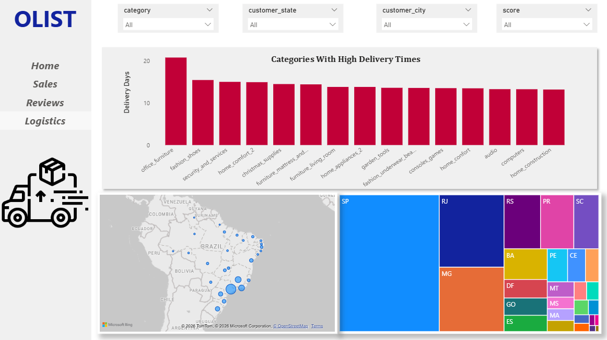

# Brazilian E-Commerce Analytics 






## Project Overview
This project provides a comprehensive end-to-end analysis of the **Olist E-commerce dataset** (2016–2018). The goal was to identify key drivers of sales performance, analyze logistics efficiency, and pinpoint underperforming product categories.

The pipeline includes **data ingestion** via Python, **relational modeling** in MySQL, **exploratory analysis** in Pandas, and **interactive visualization** in Power BI.

## Tech Stack
* **ETL & Data Engineering:** Python (MySQL Connector), SQL (Views, Joins)
* **Data Analysis:** Pandas, NumPy, Matplotlib
* **Visualization:** Power BI (DAX, Interactive Dashboards)
* **Database:** MySQL

## Key Business Insights

### 1. Regional Dominance & Logistics
* **Sao Paulo is the Powerhouse:** The state of Sao Paulo drives the highest sales volume by a significant margin. Specifically, **Sao Paulo city** acts as the central hub for the majority of revenue.
* **The "Freight Factor":** This dominance is strongly correlated with logistics costs. Sao Paulo has the **lowest average freight values**, making it the most cost-effective region for customers. Higher freight costs in other states appear to be a barrier to conversion.

### 2. Category Performance (Winners & Losers)
* **Top Performer:** `Health_beauty` is the standout category, leading sales volume consistently across the observed period.
* **Critical Weakness:** The `Security_and_services` category is a major underperformer.
    * **Low Volume:** Only 2 sales recorded between 2016–2018.
    * **Poor Experience:** Average review score of **2.5/5**.
    * **Logistics Fail:** Average delivery time tracks at nearly **2 weeks**, suggesting serious supply chain issues.
    * **Recommendation:** This category should be reviewed for discontinuation or a complete logistical overhaul.

### 3. Customer Satisfaction Trends
* **The 2016/2018 Dips:** Overall platform ratings dropped below 4 stars in late 2016 and early 2018.
    * **2016 Culprit:** Driven largely by the `bed_bath_table` category.
    * **2018 Culprit:** Driven by drops in `Home_comfort_2` and related categories.
* **Recovery Story:** Despite causing the 2018 dip, `Diapers_and_hygiene` has shown a steady recovery in ratings. The data suggests that operational issues were resolved, and the category now shows potential for growth despite its rocky start.

## How to Run

1.  **Database Setup:**
    * Ensure MySQL is running locally.
    * Run the ingestion script:
    ```bash
    python Script/data_digestion.py
    ```

2.  **Exploratory Analysis:**
    * Open `notebook/eda_analysis.ipynb` to view the Python-based data cleaning and initial charts.

3.  **Dashboard:**
    * Open `dashboard/olist_dashboard.pbix` in Power BI Desktop to interact with the visual reports.


## Repository Structure
```text
├── data/
│   ├── Processed/          # Final view used for dashboard (detailed_order_analysis.csv)
│   └── raw/                # Source data (Olist Kaggle dataset)
├── sql/
│   └── ...                 # SQL scripts for schema and table joins
├── Script/
│   └── data_digestion.py   # Python script for loading CSVs into MySQL
├── notebook/
│   └── eda_analysis.ipynb  # Pandas exploration and cleaning
├── dashboard/
│   ├── olist_dashboard.pbix  # The main Power BI file
│   └── Preview/            # Screenshots for documentation
└── requirements.txt        # Project dependencies
